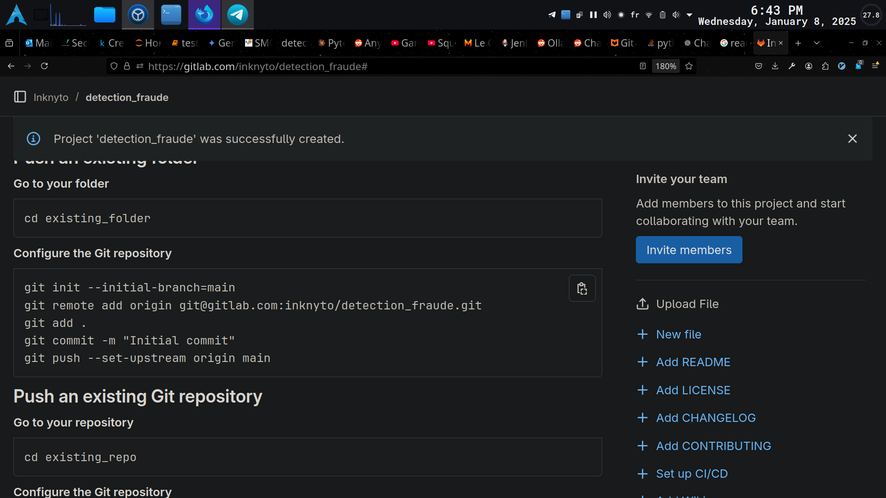
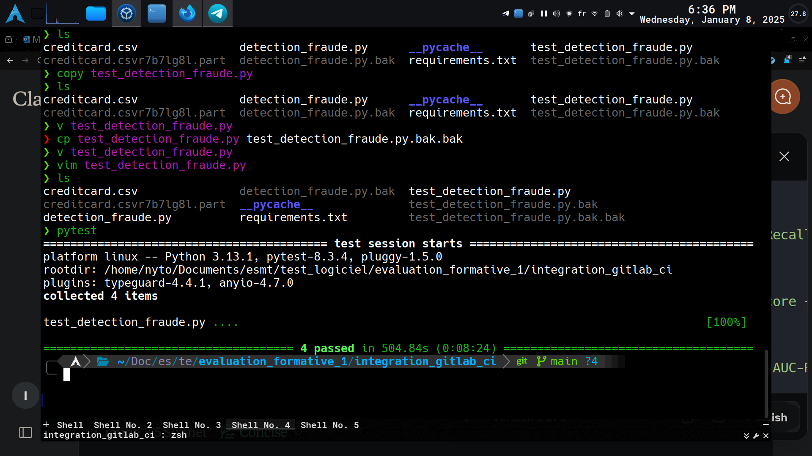
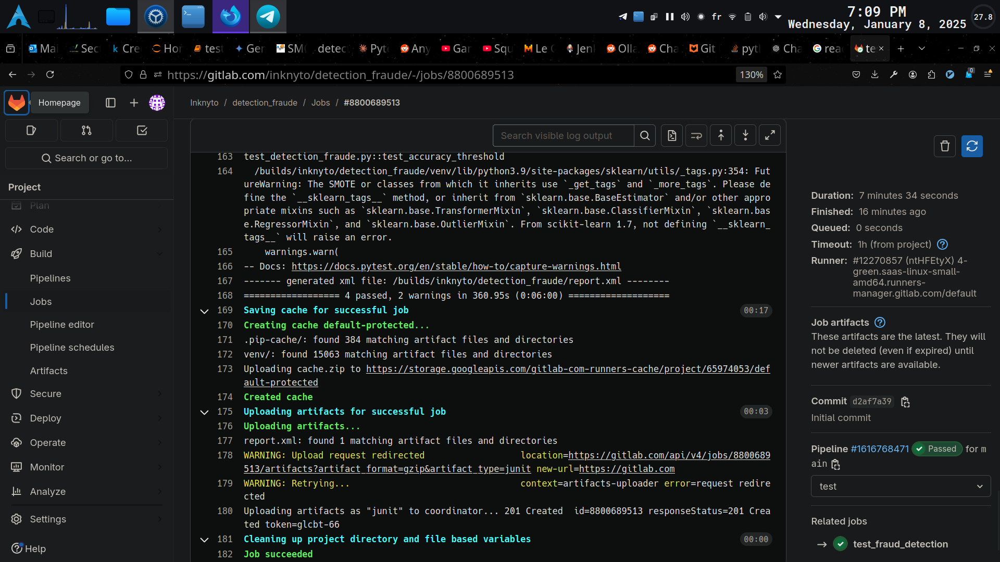

# Detection de Fraude de Carte de Crédit

Ce projet implémente un modèle d'apprentissage automatique (Machine Learning) pour détecter les transactions frauduleuses par carte de crédit. Il utilise un classifieur de type `RandomForestClassifier` et traite le déséquilibre des classes à l'aide de la technique SMOTE (Synthetic Minority Over-sampling Technique).

## Table des Matières

- [Description](#description)
- [Structure du Projet](#structure-du-projet)
- [Données](#données)
- [Installation](#installation)
- [Utilisation](#utilisation)
- [Modèle et Performance](#modèle-et-performance)
- [Tests et CI/CD](#tests-et-cicd)
- [Captures d'écran](#captures-décran)

## Description

Le but de ce projet est d'identifier les transactions frauduleuses parmi un ensemble de données de transactions de cartes de crédit. Le jeu de données est fortement déséquilibré, la majorité des transactions étant légitimes.

Le pipeline comprend :
1.  **Prétraitement des données** : Mise à l'échelle robuste (`RobustScaler`) des colonnes `Time` et `Amount`.
2.  **Gestion du déséquilibre** : Utilisation de SMOTE pour suréchantillonner la classe minoritaire dans l'ensemble d'entraînement.
3.  **Entraînement** : Utilisation d'un `RandomForestClassifier`.
4.  **Évaluation** : Mesure de la performance via la Précision, le Rappel, le F1-Score et l'AUC-ROC.

## Structure du Projet

```text
.
├── .gitlab-ci.yml           # Configuration de l'intégration continue GitLab
├── detection_fraude.py      # Script principal (entraînement et évaluation)
├── test_detection_fraude.py # Tests unitaires et d'intégration avec pytest
├── requirements.txt         # Dépendances du projet
├── creditcard.csv           # Jeu de données (téléchargé lors de l'exécution ou du CI)
├── creation_depot.png       # Capture d'écran : Création du dépôt
├── integration_tests_local.png # Capture d'écran : Tests locaux
└── pipeline_succes_1.png    # Capture d'écran : Succès du pipeline CI
```

## Données

Le fichier `creditcard.csv` contient des transactions effectuées par des cartes de crédit en septembre 2013 par des porteurs de cartes européens.
Structure simplifiée du fichier :
- **Time** : Secondes écoulées entre chaque transaction et la première transaction.
- **V1-V28** : Composantes principales obtenues par PCA pour protéger la confidentialité.
- **Amount** : Montant de la transaction.
- **Class** : Variable cible (1 pour fraude, 0 sinon).

Exemple d'en-tête :
```csv
"Time","V1","V2",...,"Amount","Class"
0,-1.3598, -0.0727, ..., 149.62, "0"
```

## Installation

1.  Clonez le dépôt :
    ```bash
    git clone https://github.com/Inknyto/detection_fraude
    cd detection_fraude
    ```

2.  Installez les dépendances :
    ```bash
    pip install -r requirements.txt
    ```

3.  Téléchargez les données (si non présentes) :
    Le script de CI utilise `gdown` pour récupérer le fichier `creditcard.csv`.

## Utilisation

Pour lancer l'entraînement et l'évaluation du modèle :
```bash
python detection_fraude.py
```

## Modèle et Performance

Le modèle est évalué sur un ensemble de test avec les métriques suivantes :
- **Précision** (Accuracy)
- **Rappel** (Recall)
- **F1-Score**
- **AUC-ROC**

Une courbe ROC est également générée pour visualiser la performance du classifieur.

## Tests et CI/CD

Les tests sont gérés par `pytest`. Ils vérifient que le modèle atteint des seuils de performance minimaux :
- Accuracy >= 0.9
- Recall >= 0.8
- F1-Score >= 0.8
- AUC-ROC >= 0.9

Pour lancer les tests localement :
```bash
pytest test_detection_fraude.py -v
```

Le projet intègre également un pipeline GitLab CI (`.gitlab-ci.yml`) qui automatise l'installation, le téléchargement des données et l'exécution des tests à chaque push sur la branche `main`.

## Captures d'écran

Voici quelques illustrations du projet :

### Création du Dépôt


### Exécution des Tests en Local


### Succès du Pipeline CI/CD


